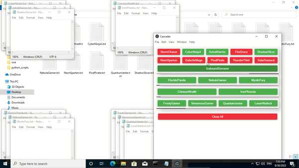

# File Cascader



## Table of Contents

- [Description](#description)
- [Usage](#usage)
- [Installation](#installation)

## Description

The File Cascader is an Electron-based application that allows users to organize and manage files by stacking them in groups. Users can create up to four stacks, move files between stacks, rearrange files within a stack, and open or close files as needed. It provides a convenient way to keep track of and work with multiple files simultaneously.

## Usage

1.  Launch the File Cascader Electron app.
2.  Create up to four stacks to categorize your files.
3.  Click on a file within a stack to open it.
4.  Right-click on a file within a stack to close it.
5.  Move files between stacks by dragging and dropping them.
6.  Rearrange files within a stack to your preferred order.
7.  Enjoy efficient file management with stack-based organization.

## Installation

To set up and run the File Stack Manager Electron app on your local machine, follow these steps:

1.  Clone the repository:
    
```bash
git clone https://github.com/khaled-ashraf-dev/cascader
```

2.  Navigate to the Electron app's directory:
```bash 
cd cascader
```
    
3.  Install the required dependencies by running:
```bash 
npm install
```
This will download and install the necessary Node.js packages.
    
4.  Install the `pywin32` package using `pip` for Windows-related functionality. Open your command prompt or terminal and run:
    
```bash
    
pip install pywin32
```    
This will install `pywin32` for handling Windows-specific features in your Electron app.
    
5.  Open the `config.json` file and configure the app settings according to your preferences, modify the values as needed for your specific use case.
    
6. Run the Electron app:
```bash
npm start
```

This will launch the File Cascader with the configured settings.
